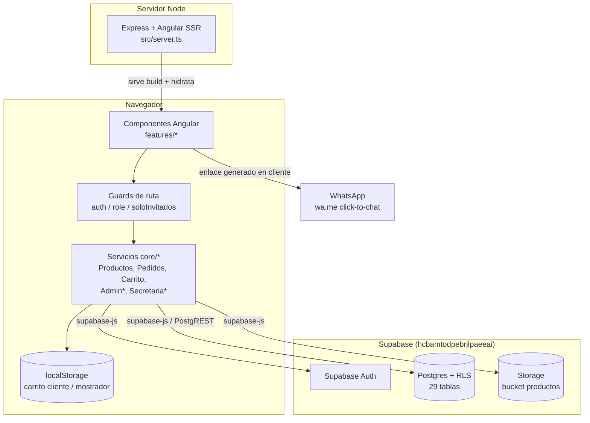
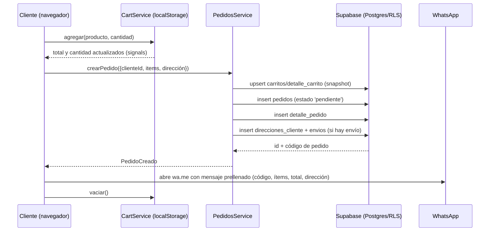
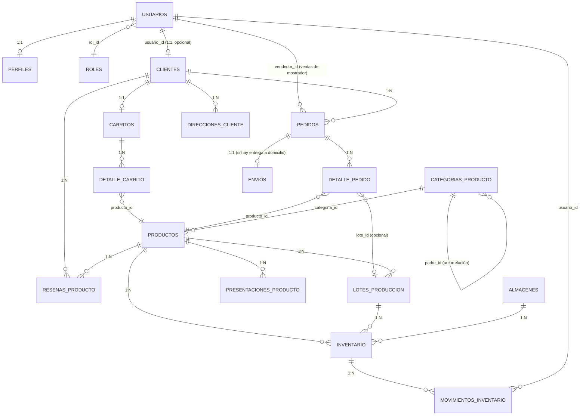

# La Cerda POS — Documentación técnica y funcional

> Generado a partir de una auditoría del código fuente, configuración, scripts y
> commits del repositorio el 2026-09-29. Todo lo marcado como **"No
> determinado"** no pudo confirmarse leyendo el proyecto — se indica qué
> archivo se revisó y qué falta para confirmarlo.

---

## 1. Visión general

**Nombre del proyecto:** el `package.json` lo llama `cliente-frontend` (nombre
técnico del andamiaje Angular CLI), pero la marca de negocio que aparece en la
UI, el README interno (`README.txt`) y los datos de prueba es **"La Cerda"** —
la documentación de decisiones (`DECISIONES_Y_PENDIENTES.md`) llama al
conjunto **"La Cerda POS"**.

**Propósito:** tienda en línea + panel de gestión interna para un negocio
boliviano de venta de **embutidos/fiambres y productos de pollo** (marca
"Pollo Sofía" para la línea de pollo). Resuelve tres necesidades a la vez:

1. **Catálogo y checkout para clientes finales** (venta minorista por la web,
   con confirmación final por WhatsApp en vez de pasarela de pago).
2. **Punto de venta de mostrador** para una secretaria/vendedora que atiende
   clientes presenciales o telefónicos y gestiona el ciclo de vida de los
   pedidos (pendiente → enviado → recibido).
3. **Panel administrativo** para gestión de productos, inventario (lotes,
   almacenes, entradas/salidas/mermas), usuarios/roles y reportes de ventas en
   PDF.

**Tipo de proyecto:** aplicación web SPA (Single Page Application) construida
con Angular 22, con soporte de servidor (Angular Universal/SSR vía Express)
configurado explícitamente para **renderizar todo en el cliente** (ver
sección 3 y `src/app/app.routes.server.ts`). No es una API independiente: la
capa de datos es directamente **Supabase** (Postgres + Auth + Storage) desde
el propio navegador.

**Estado actual:** proyecto reciente, en fase de construcción inicial recién
cerrada. El historial de git tiene **un solo commit** (`e6a5e61
"subidadocumento"`, 26/09/2026), por lo que no hay evolución incremental que
narrar todavía (ver sección 12). El propio `DECISIONES_Y_PENDIENTES.md` lo
describe como el "cierre de la construcción inicial" con una lista de
pendientes explícitos antes de producción (contraseñas de prueba, inventario
real, tarifas de envío, etc.) — es decir: **funcional pero no listo para
lanzamiento público**.

**Público objetivo:**
- **Clientes finales** (rol `cliente`): compran por catálogo web.
- **Secretaria/vendedora** (rol de base de datos `vendedor`, mostrado en la UI
  como **"Secretaria"** — ver `src/app/core/models/roles.ts:8-13`): opera el
  mostrador y da seguimiento a pedidos.
- **Administrador** (rol `admin`): gestiona catálogo, inventario, usuarios y
  reportes.

---

## 2. Stack tecnológico

### Lenguajes y frameworks principales

| Componente | Versión | Fuente |
| --- | --- | --- |
| Angular (core, forms, router, ssr, platform-browser/server) | `^22.2.0` (instalada: `22.2.0`) | `package.json`, `node_modules/@angular/core/package.json` |
| TypeScript | `~6.0.2` | `package.json` |
| Node.js (tipos) | `@types/node ^22.12.0` | `package.json` — versión de runtime real: **no determinado**, no hay `.nvmrc` ni `engines` en `package.json` |
| RxJS | `~7.8.0` | `package.json` |
| Express (servidor SSR/estático) | `^5.1.0` | `package.json`, `src/server.ts` |

### Librerías de negocio

| Librería | Uso |
| --- | --- |
| `@supabase/supabase-js` `^2.117.2` | Cliente único de datos: Auth, Postgres (via PostgREST) y Storage. `src/app/core/supabase/supabase.service.ts` |
| `chart.js` `^4.5.1` | Gráfico de línea de ventas en el dashboard de admin. `src/app/features/admin/dashboard/dashboard.ts` |
| `jspdf` `^4.2.1` + `jspdf-autotable` `^5.0.8` | Generación de reportes de ventas/stock en PDF. `src/app/features/admin/reportes/reportes.ts` |

### Build, dev y herramientas

- **Build/CLI:** `@angular/cli` / `@angular/build` `^22.2.0`, builder moderno `@angular/build:application` (esbuild-based) — ver `angular.json`.
- **Testing:** `vitest` `^5.0.0` como test runner de `ng test` (builder `@angular/build:unit-test`), con `jsdom` `^30.0.0` como entorno DOM.
- **Formateo:** `prettier` `^3.8.1`, configurado en `.prettierrc` (comillas simples, ancho 100, parser `angular` para `.html`).
- **Estilo de código:** `.editorconfig` (2 espacios, UTF-8, comillas simples en `.ts`). **No hay ESLint configurado** (no existe `.eslintrc*` ni dependencia `eslint` en `package.json`) — no determinado si se usa alguna otra herramienta de lint fuera del repo.
- **Procesamiento de imágenes (solo en el script de ingesta, no en runtime de la app):** `sharp` `^0.34.5`, `tsx` `^4.23.15` para ejecutar TypeScript directo (`npm run seed`).
- **CI/CD:** no se encontró configuración (`.github/workflows`, `.gitlab-ci.yml`, etc. no existen en el repo). **No determinado** si hay pipeline externo.
- **Gestor de paquetes:** npm, fijado como `packageManager: "npm@12.1.0"` en `package.json`; `package-lock.json` con `lockfileVersion: 3`.

### Base de datos y servicios externos

- **Supabase** (proyecto `hcbamtodpebrjlpaeeai`, URL `https://hcbamtodpebrjlpaeeai.supabase.co`) provee:
  - **Postgres** como base de datos relacional (esquema `public`, 29 tablas — ver sección 5).
  - **Supabase Auth** para autenticación (email/password) y como fuente de identidad (`auth.users`), enlazado 1:1 a la tabla de negocio `usuarios`.
  - **Supabase Storage** (bucket `productos`) para las imágenes de producto, subidas como WebP.
  - Acceso vía la **clave publicable (`sb_publishable_...`)** embebida en `src/app/core/supabase/supabase.config.ts` — es pública por diseño; el control de acceso real se hace con **Row Level Security (RLS)** en Postgres (confirmado por comentarios en el propio código y por pruebas descritas en `DECISIONES_Y_PENDIENTES.md`, aunque las políticas RLS en sí **no están en este repositorio** — viven en Supabase; no determinado su contenido exacto sin acceso al proyecto).
  - **MCP de Supabase** configurado en `.mcp.json` para que un asistente de IA con esa herramienta pueda operar el proyecto (docs, cuenta, base de datos, debugging, funciones, branching) — es tooling de desarrollo, no parte del runtime de la app.
- **WhatsApp:** no hay integración de API real; se generan enlaces `wa.me` ("click to chat") — ver `src/app/core/whatsapp.ts:6-16` y sección 4.

---

## 3. Arquitectura

### Estructura de carpetas

```
src/
├── app/
│   ├── core/              # Servicios sin UI: acceso a datos, auth, modelos
│   │   ├── admin/         # Servicios usados solo por el panel de admin
│   │   ├── auth/          # AuthService, guards de ruta, validadores de formularios
│   │   ├── cart/          # CartService (carrito en localStorage)
│   │   ├── catalogo/      # ProductosService, PedidosService (catálogo + pedidos del cliente)
│   │   ├── models/        # Tipos generados de Supabase + modelos de dominio (roles, estados)
│   │   ├── secretaria/    # Servicios usados solo por el flujo de secretaria
│   │   ├── supabase/      # Configuración y wrapper del cliente Supabase
│   │   └── whatsapp.ts    # Helpers para construir enlaces/mensajes de WhatsApp
│   ├── features/          # Un subdirectorio por pantalla/flujo, lazy-loaded
│   │   ├── auth/           (login, registro)
│   │   ├── catalogo/       (lista de productos, ficha de producto)
│   │   ├── checkout/       (confirmación de compra del cliente web)
│   │   ├── pedidos-cliente/(historial "Mis pedidos" del cliente)
│   │   ├── seguimiento/    (seguimiento de un pedido + confirmar recepción)
│   │   ├── secretaria/     (dashboard, detalle de pedido, venta de mostrador)
│   │   └── admin/          (dashboard, productos, inventario, usuarios, reportes)
│   ├── layout/             # Header y footer globales
│   ├── shared/ui/          # Design system interno (botón, card, badge, íconos, etc.)
│   ├── app.ts / app.html   # Shell raíz (fondo decorativo + header + router-outlet + footer)
│   ├── app.routes.ts       # Árbol de rutas raíz + guards
│   ├── app.routes.server.ts# Config de renderizado SSR (todo en modo cliente)
│   ├── app.config.ts       # Providers de la app (router, locale es-BO, hidratación)
│   └── app.config.server.ts# Providers exclusivos del bundle de servidor
├── styles/                 # Partials SCSS globales (tokens, botones, formularios, etc.)
├── main.ts / main.server.ts# Bootstrap de browser y de servidor
└── server.ts               # Servidor Express que sirve el build y renderiza vía Angular SSR
```

Fuera de `src/`:

- `embutidos/` y `Pollo_Sofia_25_productos_4K/`: **fuente de datos del catálogo** — pares de imagen `.png` + ficha `.txt` por producto, consumidos por `scripts/seed-productos.ts` (ver sección 4).
- Los 26 archivos numerados sueltos en la raíz (`01_..._` a `26_..._`): un borrador anterior de esas mismas fichas, **no ingerido**, dejado intacto a propósito (ver `DECISIONES_Y_PENDIENTES.md:19-26`).
- `scripts/seed-productos.ts`: script de ingesta de catálogo a Supabase (`npm run seed`).
- `public/`: activos estáticos servidos tal cual (logo, favicon).
- `dist/`: build compilado (generado, no versionado en el sentido de trabajo diario).
- `DECISIONES_Y_PENDIENTES.md`, `PRODUCTOS_PENDIENTES.md`, `USUARIOS_PRUEBA.md`: documentación operativa generada durante la construcción (decisiones tomadas, pendientes por producto, credenciales de prueba).

### Patrón arquitectónico

- **Frontend:** Angular standalone components (sin `NgModule`), enrutamiento con **lazy loading** por `loadComponent`/`loadChildren` en cada feature, y **signals** de Angular (`signal`, `computed`, `effect`) como mecanismo principal de estado local — no se usa NgRx ni ningún store global aparte de los propios servicios `providedIn: 'root'`.
- **Capa de datos:** patrón **"servicio por dominio"** dentro de `core/` (uno por área: productos, pedidos, carrito, inventario admin, etc.), cada uno inyectando el `SupabaseService` y hablando directo con PostgREST vía el SDK de Supabase. **No hay backend propio ni capa de API intermedia**: el navegador consulta Postgres directamente, y la seguridad de acceso recae en RLS (ver sección 8).
- **Autorización:** basada en **guards de ruta** (`authGuard`, `roleGuard(roles)`, `soloInvitadosGuard` en `src/app/core/auth/guards.ts`) que consultan el rol cacheado en `AuthService` antes de activar una ruta.
- **Multi-tenencia de carrito:** el mismo `CartService` se usa para el carrito del cliente y para la venta de mostrador de la secretaria, diferenciados por una clave de `localStorage` distinta inyectada vía `InjectionToken` (`CART_STORAGE_KEY`) a nivel de árbol de rutas — ver `src/app/features/secretaria/venta/venta.routes.ts:20-23` y el comentario ahí mismo sobre por qué **no** se reutiliza el array de rutas del catálogo por *spread* (bug de caché de rutas de Angular ya solucionado).
- **Renderizado:** SSR configurado pero **desactivado a propósito** (`RenderMode.Client` en `src/app/app.routes.server.ts`) porque toda la app depende de sesión de usuario y datos en vivo — se comporta como una SPA clásica servida por un runtime Node/Express que además hidrata el cliente (`provideClientHydration()` en `app.config.ts`).

### Diagrama de componentes



### Flujo de datos principal (compra de un cliente)



---

## 4. Funcionalidades

### 4.1 Catálogo (público, sin login) — `features/catalogo`

- **Archivos clave:** `catalogo/lista/lista.ts`, `catalogo/detalle/detalle.ts`, `core/catalogo/productos.service.ts`.
- Lista de productos filtrable por categoría (chips) y por texto (normalizado sin acentos, `lista.ts:10-12`), con imagen representativa por categoría.
- Ficha de producto: descripción, presentaciones (peso/formato), reseñas moderadas (`resenas_producto` con `moderado = true`), selector de cantidad y "agregar al carrito".
- Ambas pantallas se **reutilizan tal cual** dentro del flujo de venta de mostrador de secretaria (mismo componente, distinta instancia de carrito).

### 4.2 Carrito — `core/cart/cart.service.ts`, `shared/ui/cart-drawer`

- Estado 100% en cliente (`localStorage`), sin sincronización entre dispositivos (limitación documentada en `DECISIONES_Y_PENDIENTES.md:63-65`).
- Drawer lateral (`app-cart-drawer`) con botón "Ir a pagar" configurable por ruta (`/checkout` para cliente, `/secretaria/venta/confirmar` para mostrador).

### 4.3 Autenticación y registro — `features/auth`, `core/auth`

- **Login** (`login.ts`): email (debe terminar en `@gmail.com`, ver `emailGmailValidator`) + password contra Supabase Auth; redirige según rol (`ROLE_HOME_ROUTE`).
- **Registro** (`registro.ts`): autoservicio, **solo crea clientes** (roles de staff se crean por SQL/admin — comentario en `auth.service.ts:104`). Valida nombre, email Gmail, celular boliviano (`6XXXXXXX`/`7XXXXXXX`) y password fuerte (8+ caracteres, mayúscula, minúscula, número).
- Un trigger de base de datos (`on_auth_user_created`, mencionado en `USUARIOS_PRUEBA.md:3` — **no está en este repo**, vive en Supabase) crea automáticamente las filas en `usuarios`, `perfiles` y, si aplica, `clientes`.
- **Pendiente operativo bloqueante:** la verificación de email de Supabase Auth sigue activa; hay que desactivarla manualmente en el dashboard de Supabase antes de abrir el registro público (`DECISIONES_Y_PENDIENTES.md:7-17`).

### 4.4 Checkout del cliente — `features/checkout`

- Formulario de dirección de entrega (+ enlace de ubicación opcional) → `PedidosService.crearPedido()` con `tipoVenta: 'minorista'`, `canalOrigen: 'cliente_web'`.
- Al confirmar, genera un enlace `wa.me` con el detalle del pedido dirigido al **número de negocio** (`WHATSAPP_NEGOCIO = '59169541819'`, `core/whatsapp.ts:4`) — no hay pasarela de pago ni notificación automática, el clic lo dispara el usuario.

### 4.5 Mis pedidos y seguimiento — `features/pedidos-cliente`, `features/seguimiento`

- Historial de pedidos del cliente autenticado con estado traducido a 4 pasos de UI (`pendiente`/`enviado`/`recibido`/`cancelado`, ver `core/models/estado-pedido.ts`).
- Pantalla de seguimiento de un pedido puntual: **poll cada 20 segundos** (`INTERVALO_ACTUALIZACION_MS`) mientras el pedido esté `pendiente` o `enviado`; permite al cliente **marcar como recibido** (única transición que su RLS le permite, según comentario en `pedidos.service.ts:111`).

### 4.6 Secretaria (rol `vendedor`) — `features/secretaria`

- **Dashboard** (`secretaria/dashboard`): contadores de pedidos pendientes/enviados/recibidos-hoy, lista filtrable por esos grupos.
- **Detalle de pedido** (`secretaria/pedido-detalle`): cambia el estado crudo del pedido (6 estados de negocio, no solo los 4 agrupados de UI), edita fecha estimada y costo de envío, y genera el enlace de WhatsApp de cambio de estado hacia el cliente (si tiene teléfono registrado).
- **Venta de mostrador** (`secretaria/venta`): reutiliza el catálogo/ficha del cliente con un carrito propio; busca un cliente existente (por nombre/identificación/email/teléfono) o vende de forma anónima; confirma la venta con modalidad `local` o `envio`.

### 4.7 Administración — `features/admin`

- **Dashboard** (`admin/dashboard`): KPIs (productos activos, bajo stock, ventas hoy/ayer/semana/mes con variación %), ranking de producto más y menos vendido, gráfico de línea de ventas de los últimos 14 días (Chart.js) — se oculta si hay menos de 2 días con ventas reales.
- **Productos** (`admin/productos/lista`, `admin/productos/formulario`): alta/edición de producto (nombre, SKU, categoría, unidad de medida, precios, imagen subida a Storage con validación de tipo/tamaño ≤15 MB), gestión de presentaciones (peso/formato) por producto.
- **Inventario** (`admin/inventario`): listado con alerta de bajo stock (<10 unidades) y de vencimiento próximo (≤7 días); alta de almacenes; registro de entradas (crea lote de producción + fila de inventario + movimiento); registro de salidas/mermas (resta cantidad y valida que no quede negativa) — **la salida usa `prompt()`/`alert()` nativos del navegador** como atajo de UI, señalado como mejora pendiente en `DECISIONES_Y_PENDIENTES.md:60-62`.
- **Usuarios** (`admin/usuarios`): lista usuarios con su rol y perfil, permite cambiar rol y estado (`activo`/`inactivo`/`bloqueado`).
- **Reportes** (`admin/reportes`): genera un PDF (jsPDF + autoTable) con total vendido, número de pedidos, producto más/menos vendido, detalle de ventas por producto y stock actual por categoría, para un rango de fechas.

### 4.8 "Pantallas" y rutas (no hay API HTTP propia — ver nota)

La app **no expone endpoints REST propios**; toda persistencia es contra las tablas de Supabase vía PostgREST. La tabla siguiente documenta las **rutas del router de Angular** (lo más cercano a "endpoints" en este proyecto) y qué guard las protege:

| Ruta | Componente | Guard | Rol requerido |
| --- | --- | --- | --- |
| `/` | redirige a `/catalogo` | — | público |
| `/auth/login` | `Login` | `soloInvitadosGuard` | ninguno (solo invitados) |
| `/auth/registro` | `Registro` | `soloInvitadosGuard` | ninguno |
| `/catalogo`, `/catalogo/:id` | `Lista`, `Detalle` | — | público |
| `/checkout` | `Checkout` | `roleGuard(['cliente'])` | `cliente` |
| `/mis-pedidos` | `PedidosCliente` | `roleGuard(['cliente'])` | `cliente` |
| `/mis-pedidos/:id/seguimiento` | `Seguimiento` | `roleGuard(['cliente'])` | `cliente` |
| `/secretaria`, `/secretaria/:id` | `Dashboard`, `PedidoDetalle` | `roleGuard(['vendedor'])` | `vendedor` |
| `/secretaria/venta`, `/secretaria/venta/:id`, `/secretaria/venta/confirmar` | `VentaShell` + `Lista`/`Detalle`/`ConfirmarVenta` | `roleGuard(['vendedor'])` | `vendedor` |
| `/admin`, `/admin/productos(/nuevo\|/:id)`, `/admin/inventario`, `/admin/usuarios`, `/admin/reportes` | `DashboardAdmin`, `ListaProductosAdmin`, `FormularioProductoAdmin`, `InventarioAdmin`, `UsuariosAdmin`, `ReportesAdmin` | `roleGuard(['admin'])` | `admin` |
| `**` | redirige a `/catalogo` | — | público |

(Definiciones completas: `src/app/app.routes.ts`, `features/catalogo/catalogo.routes.ts`, `features/secretaria/secretaria.routes.ts`, `features/secretaria/venta/venta.routes.ts`, `features/admin/admin.routes.ts`.)

---

## 5. Modelo de datos

Fuente: `src/app/core/models/database.types.ts`, generado automáticamente
desde Supabase (comentario en el propio archivo: "No editar a mano"). Esquema
`public`, **29 tablas**, sin vistas ni funciones RPC personalizadas más allá
de `auth_cliente_id()` y `auth_rol()` (funciones auxiliares de RLS, cuyo
cuerpo SQL no está en este repo — **no determinado**).

### Enums

| Enum | Valores |
| --- | --- |
| `rol_enum` | `admin`, `vendedor`, `cliente` |
| `tipo_cliente_enum` | `minorista`, `mayorista` |
| `estado_pedido_enum` | `pendiente`, `confirmado`, `en preparación`, `enviado`, `entregado`, `cancelado` |
| `estado_usuario_enum` | `activo`, `inactivo`, `bloqueado` |
| `estado_factura_enum` | `pagada`, `pendiente`, `vencida`, `anulada` |
| `metodo_pago_enum` | `efectivo`, `transferencia`, `tarjeta`, `crédito` |

### Tablas activamente usadas por el frontend

`usuarios`, `roles`, `perfiles`, `clientes`, `productos`, `categorias_producto`,
`presentaciones_producto`, `resenas_producto`, `carritos`, `detalle_carrito`,
`pedidos`, `detalle_pedido`, `direcciones_cliente`, `envios`, `inventario`,
`almacenes`, `lotes_produccion`, `movimientos_inventario`.

### Tablas presentes en el esquema pero sin uso confirmado en el código de la app

`auditoria_logs`, `certificaciones_sanitarias`, `cuentas_por_cobrar`, `cupones`,
`detalle_factura`, `facturas`, `lote_insumos`, `notificaciones`, `pagos`,
`promociones`, `proveedores`, `zonas_reparto` (verificado por búsqueda de texto
en `src/`; `zonas_reparto` además se documenta explícitamente como vacía en
`DECISIONES_Y_PENDIENTES.md:56`). Probablemente forman parte de un alcance más
amplio (facturación fiscal, cupones, trazabilidad de insumos) planificado pero
no conectado todavía a ninguna pantalla.

### Desviaciones documentadas frente a un esquema "original" de referencia

Según `DECISIONES_Y_PENDIENTES.md:35-49` (la sección 3 que menciona no está en
este repo, es un documento de requerimientos externo):

1. `productos.imagen` y `perfiles.foto` son `text` (URL de Storage), no `bytea`.
2. `usuarios.id` referencia `auth.users(id)` (extensión 1:1 de Supabase Auth); `password_hash` no autentica, guarda un valor fijo — Auth gestiona el hash real.
3. `clientes.usuario_id` (añadida) enlaza el cliente de negocio con el usuario autenticado, necesaria para que RLS permita a un cliente ver sus propios pedidos.
4. `pedidos.codigo` (añadida): código de orden legible.
5. `envios.costo_envio` (añadida).
6. `carritos.cliente_id` y `perfiles.usuario_id` son `unique` (relación 1:1 real), necesario para que Supabase infiera joins y para el `upsert` de carrito en checkout.

### Diagrama entidad-relación (tablas activas)



Campos clave de las tablas centrales (columnas abreviadas; tipos exactos en
`database.types.ts`):

- **`productos`**: `id`, `sku` (único, usado como clave de negocio), `nombre`, `descripcion`, `categoria_id → categorias_producto`, `precio_base`, `precio_mayorista`, `margen`, `imagen` (URL de Storage), `unidad_medida` (`kg`/`unidad`/`paquete`, texto libre no un enum de Postgres), `estado` (boolean, activo/inactivo).
- **`pedidos`**: `id`, `codigo` (legible), `cliente_id` (nulo = venta anónima de mostrador), `vendedor_id` (solo mostrador), `tipo_venta` (`minorista`/`mayorista`), `estado` (`estado_pedido_enum`), `canal_origen` (texto libre: `'cliente_web'` \| `'secretaria_mostrador'`, no un enum de Postgres), `modalidad_entrega` (texto libre: `'local'` \| `'envio'`).
- **`clientes`**: `identificacion` (CI, requerido), `usuario_id` (único, opcional — un cliente de mostrador puede no tener cuenta web), `vendedor_id`, `tipo`, `limite_credito`, `lista_precios`.

---

## 6. Configuración y entorno

### Variables/constantes de configuración (no hay `.env` en este proyecto)

El proyecto **no usa variables de entorno para el runtime del navegador** —
las claves de Supabase están **embebidas como constantes en el código fuente**
porque son la clave *publishable* (segura para el bundle, según el comentario
en el propio archivo):

| Nombre | Dónde vive | Descripción | Obligatoria |
| --- | --- | --- | --- |
| `SUPABASE_URL` | `src/app/core/supabase/supabase.config.ts:4` | URL del proyecto Supabase | Sí (hardcodeada) |
| `SUPABASE_PUBLISHABLE_KEY` | `src/app/core/supabase/supabase.config.ts:5` | Clave pública (anon/publishable) de Supabase | Sí (hardcodeada) |
| `PORT` | `src/server.ts:53` | Puerto del servidor Express en producción (`serve:ssr:cliente-frontend`) | No — por defecto `4000` |
| `SEED_ADMIN_EMAIL` / `SEED_ADMIN_PASSWORD` | `scripts/seed-productos.ts:36-37` | Credenciales usadas **solo** por el script de ingesta de catálogo (`npm run seed`) para autenticarse como admin y poder escribir en `productos`/Storage bajo RLS | No — cae a las credenciales de prueba (`admin@gmail.com` / `LaCerda2026!Admin`) si no se definen |

⚠️ Nótese que la clave de Supabase publishable **y** la contraseña de prueba
del admin están escritas en texto plano dentro del repositorio (ver sección 8,
riesgos de seguridad).

### Archivos de configuración

| Archivo | Función |
| --- | --- |
| `angular.json` | Configuración del workspace Angular CLI: builder de build/serve/test, presupuestos de tamaño de bundle (650 kB advertencia / 1 MB error), assets (`public/` → raíz), SSR (`entry: src/server.ts`). |
| `tsconfig.json` / `tsconfig.app.json` / `tsconfig.spec.json` | Compilación TypeScript estricta (`noImplicitOverride`, `noImplicitReturns`, `strictInjectionParameters`, `strictInputAccessModifiers`, `target: ES2022`). `tsconfig.spec.json` añade tipos de Vitest. |
| `.prettierrc` | Formateo: comillas simples, ancho 100, parser `angular` para plantillas `.html`. |
| `.editorconfig` | Indentación 2 espacios, UTF-8, comillas simples en `.ts`. |
| `.mcp.json` | Registra el servidor MCP de Supabase (para asistentes de IA con esa capacidad), no usado en runtime de la app. |
| `.gitignore` | Ignora `dist/`, `node_modules/`, cachés de Angular/IDE — **no incluye ningún patrón de `.env`** porque no existe ese mecanismo aquí. |

### Requisitos previos

- **Node.js**: versión exacta no determinada (no hay `engines` en `package.json` ni `.nvmrc`); debe ser compatible con Angular 22 y Vitest 5 (Node ≥ 18/20 típicamente, a confirmar contra la matriz oficial de Angular 22).
- **npm** `12.1.0` (declarado como `packageManager`).
- Acceso de red al proyecto Supabase (`hcbamtodpebrjlpaeeai.supabase.co`) — no se puede levantar el catálogo/datos sin él, no hay modo offline ni mocks.
- Para `npm run seed`: credenciales válidas de un usuario `admin` en ese proyecto Supabase (RLS lo exige) y las carpetas `embutidos/`/`Pollo_Sofia_25_productos_4K/` presentes en la raíz.

---

## 7. Instalación y ejecución

```bash
# 1. Instalar dependencias
npm install

# 2. Levantar el servidor de desarrollo (http://localhost:4200)
npm start
# equivalente a: ng serve

# 3. (Opcional, una sola vez o tras actualizar el catálogo)
#    Sube productos + imágenes desde embutidos/ y Pollo_Sofia_25_productos_4K/
#    a Supabase. Requiere que la cuenta admin de prueba exista y RLS activo.
npm run seed

# 4. Ejecutar pruebas unitarias (Vitest vía Angular CLI)
npm test
# equivalente a: ng test

# 5. Build de producción (SSR + browser bundle en dist/cliente-frontend)
npm run build
# equivalente a: ng build

# 6. Servir el build SSR/estático ya compilado
npm run serve:ssr:cliente-frontend
# node dist/cliente-frontend/server/server.mjs (puerto 4000 por defecto)
```

**Scripts declarados en `package.json`:**

| Script | Comando real | Uso |
| --- | --- | --- |
| `start` | `ng serve` | Desarrollo local con recarga en caliente |
| `build` | `ng build` | Build de producción (`--configuration production` es el default del builder) |
| `watch` | `ng build --watch --configuration development` | Build incremental en modo desarrollo |
| `test` | `ng test` | Corre la suite Vitest |
| `seed` | `tsx scripts/seed-productos.ts` | Ingesta del catálogo de imágenes/fichas a Supabase |
| `serve:ssr:cliente-frontend` | `node dist/cliente-frontend/server/server.mjs` | Sirve el build ya compilado con Express/SSR |

No hay `Dockerfile`, `docker-compose.yml`, `Makefile` ni pipeline de CI en el
repositorio — **no determinado** cómo se despliega hoy en producción (ver
sección 10).

---

## 8. Seguridad

### Autenticación y autorización

- **Autenticación:** delegada por completo a **Supabase Auth** (email +
  password). El frontend nunca maneja contraseñas en texto plano más allá de
  pasarlas al SDK de Supabase por HTTPS.
- **Autorización de UI:** guards de ruta (`authGuard`, `roleGuard`,
  `soloInvitadosGuard`) que leen el rol cacheado en `AuthService` — esto es
  **solo una capa de experiencia de usuario**; la autorización real de datos
  depende de RLS en Postgres, que **no está versionada en este repositorio**
  (vive en el proyecto Supabase). Esto significa que **no se puede auditar
  aquí** si las políticas RLS son correctas o completas; solo se puede
  observar el comportamiento esperado documentado (ej. "un cliente solo puede
  cambiar su pedido a `entregado`", comentario en `pedidos.service.ts:111`).
- **Roles:** tres roles de negocio (`admin`, `vendedor`, `cliente`) mapeados
  1:1 a `roles.nombre`; el registro público solo puede crear `cliente`
  (`auth.service.ts:104`).

### Manejo de secretos y datos sensibles

- ⚠️ **`SUPABASE_URL`/`SUPABASE_PUBLISHABLE_KEY` embebidas en código fuente**
  (`src/app/core/supabase/supabase.config.ts`). Es una práctica aceptada por
  el propio diseño de Supabase (clave *publishable*, protegida por RLS) y así
  lo documenta un comentario en el archivo — **no es, por sí sola, una
  vulnerabilidad**, siempre que RLS esté correctamente configurado en todas
  las tablas.
- ⚠️ **`scripts/seed-productos.ts` contiene credenciales de la cuenta admin de
  prueba como valor por defecto** (`ADMIN_EMAIL`/`ADMIN_PASSWORD`, líneas
  36-37) y **repite la misma clave publishable** de Supabase. El propio
  archivo advierte cambiar esto por variables de entorno reales antes de
  producción, pero el *default* actual es una contraseña real de una cuenta
  de prueba activa en el proyecto Supabase real.
- ⚠️ **`USUARIOS_PRUEBA.md` versiona en texto plano 3 contraseñas de cuentas
  reales** (admin, secretaria, cliente) del proyecto Supabase productivo
  (`hcbamtodpebrjlpaeeai`), con una nota "No compartir este archivo fuera del
  equipo de desarrollo" — pero al estar en el repo git, cualquiera con acceso
  al repositorio las tiene. **Recomendación:** rotarlas y no versionarlas
  antes de dar acceso amplio al repo o de ir a producción (`DECISIONES_Y_PENDIENTES.md:58`
  ya lo marca como pendiente).
- **`.gitignore`** no excluye ningún archivo de secretos porque el proyecto no
  usa el patrón `.env` — todo secreto vive directamente en archivos versionados,
  lo cual concentra el riesgo anterior.

### Riesgos / malas prácticas detectadas

1. **Credenciales reales versionadas en Markdown y en un script** (ver arriba) — el hallazgo de seguridad más claro del repo.
2. **`inventario-admin.service.ts`** valida `nuevaCantidad < 0` en el cliente antes de restar stock (`registrarMovimiento`), pero **no hay una transacción atómica** (son 2 llamadas HTTP separadas: `update` de `inventario` + `insert` en `movimientos_inventario`). Dos solicitudes concurrentes podrían dejar el stock inconsistente si no hay una restricción/trigger equivalente en la base (no determinado si existe, vive en Supabase).
3. **UI con `prompt()`/`alert()` nativos** para registrar salidas de inventario (`inventario.ts:104,110`) — funcional pero es una superficie de UX (no de seguridad) señalada como pendiente por el propio equipo.
4. **Sin CSP, cabeceras de seguridad o rate limiting visibles** en `src/server.ts` — el servidor Express solo sirve estáticos y delega el resto a Angular SSR; no determinado si hay un proxy/CDN delante en producción que añada esas protecciones.
5. **`resenas_producto.moderado`** exige moderación explícita antes de mostrar una reseña (bien) pero **no hay pantalla de moderación** en `features/admin` — no se encontró ningún componente que liste/apruebe reseñas pendientes. Falta esa pieza de UI para que el campo `moderado` se pueda operar sin ir directo a la base.

### Buenas prácticas ya presentes

- Contraseñas de registro validadas con reglas de complejidad (`passwordSeguraValidator`).
- Uso de `bypassSecurityTrustHtml` en `Icon` está justificado porque el contenido SVG es siempre estático y de autoría propia, nunca datos de usuario (comentario explícito en `icon.ts:8-9`).
- Separación de responsabilidades por rol tanto en rutas (guards) como en los propios servicios (`*-admin.service.ts` vs. `*-secretaria.service.ts`).

---

## 9. Testing y calidad

- **Framework:** Vitest `^5.0.0` (vía el builder `@angular/build:unit-test`), entorno `jsdom`.
- **Cobertura real encontrada:** **un solo archivo de prueba**, `src/app/app.spec.ts`, que verifica que el componente raíz `App` se instancia correctamente. **No hay pruebas para ningún servicio de dominio, guard, validador ni componente de feature** (confirmado: `find src -name "*.spec.ts"` solo devuelve ese archivo).
- **Cobertura aproximada:** no determinada numéricamente (no hay reporte de cobertura configurado, ni `coverage/` generado); dado que solo existe una prueba trivial, la cobertura real del código de negocio es efectivamente nula.
- **Cómo ejecutarlas:**
  ```bash
  npm test        # ng test
  ```
- **Pruebas E2E:** no existen (README genérico de Angular CLI las menciona como opcionales, sin framework elegido). `DECISIONES_Y_PENDIENTES.md:76-81` documenta que **no se pudo probar en navegador real (Playwright)** durante la construcción porque Chrome no estaba disponible en ese entorno, y recomienda expresamente una verificación manual del flujo completo antes de cerrar la fase.
- **Verificación manual ya realizada** (según el mismo documento): build de producción sin errores, `npm test` en verde, lectura pública de productos/imágenes contra el Supabase real, bloqueo de escritura anónima por RLS, y login del usuario admin de prueba — todo por HTTP directo, sin interacción de UI en navegador.

---

## 10. Despliegue e infraestructura

- **Docker:** no hay `Dockerfile` ni `docker-compose.yml` en el repositorio.
- **CI/CD:** no hay configuración de pipelines (`.github/workflows`, etc.).
- **Hosting:** no determinado. El proyecto está preparado para correr como servidor Node standalone (`npm run serve:ssr:cliente-frontend`, Express en el puerto `PORT` o `4000`), lo cual es compatible con cualquier host que ejecute Node (VPS, Render, Railway, Fly.io, etc.) o con adaptarlo a serverless — pero **nada en el repo indica cuál se usa hoy**.
- **Base de datos e infraestructura de backend:** completamente delegada a **Supabase** (Postgres gestionado, Auth, Storage), proyecto `hcbamtodpebrjlpaeeai` — es infraestructura externa gestionada por Supabase, no algo que este repo despliegue.
- **Build de producción:** `ng build` genera `dist/cliente-frontend/` con dos subcarpetas: `browser/` (assets estáticos del cliente) y `server/` (bundle SSR + `server.mjs`), servidos por Express (`src/server.ts`).

---

## 11. Dependencias

### Producción (`dependencies`)

| Paquete | Para qué se usa |
| --- | --- |
| `@angular/common`, `@angular/compiler`, `@angular/core`, `@angular/forms`, `@angular/platform-browser`, `@angular/platform-server`, `@angular/router`, `@angular/ssr` | Framework Angular completo (UI, formularios reactivos, enrutamiento, SSR). |
| `@supabase/supabase-js` | Cliente único de acceso a datos, autenticación y storage. |
| `chart.js` | Gráfico de tendencia de ventas en el dashboard de admin. |
| `express` | Servidor HTTP que sirve el build y ejecuta el motor SSR de Angular. |
| `jspdf`, `jspdf-autotable` | Generación de reportes de ventas/stock en PDF descargable. |
| `rxjs` | Dependencia transitiva/estructural de Angular (observables). |
| `tslib` | Helpers de compilación TypeScript requeridos por Angular. |

### Desarrollo (`devDependencies`)

| Paquete | Para qué se usa |
| --- | --- |
| `@angular/build`, `@angular/cli`, `@angular/compiler-cli` | Toolchain de build/serve/test de Angular. |
| `@types/express`, `@types/node` | Tipos TypeScript para Node/Express. |
| `jsdom` | Entorno DOM simulado para Vitest. |
| `prettier` | Formateo de código. |
| `sharp` | Redimensionado/conversión a WebP de las imágenes de producto en `scripts/seed-productos.ts` (no se usa en runtime de la app). |
| `tsx` | Ejecuta TypeScript directamente para correr el script de ingesta. |
| `typescript` | Compilador. |
| `vitest` | Test runner. |

### Dependencias desactualizadas o con vulnerabilidades conocidas

**No determinado por auditoría estática de este documento** — no se ejecutó
`npm audit` ni `npm outdated` como parte de este análisis (evitado
deliberadamente para no alterar `package-lock.json` ni depender de acceso de
red al registro de npm en este entorno). Para completar esta sección, correr:

```bash
npm outdated
npm audit
```

Dato observable sin red: todas las dependencias usan rangos `^`/`~` recientes
(Angular `22.2.0`, TypeScript `~6.0.2`) — son versiones actuales al momento de
la construcción del proyecto (septiembre de 2026), sin señales de paquetes
abandonados en el propio `package.json`.

---

## 12. Historial y contribución

- **Historial de git:** el repositorio tiene **un único commit** en la rama
  `main`: `e6a5e61 "subidadocumento"` (26/09/2026), autor `yosevolar123-cyber
  <yosevolar123@gmail.com>`. No hay ramas adicionales (`git branch -a` solo
  muestra `main` y `origin/main`), ni tags, ni otros colaboradores. Es decir:
  **el repositorio se subió ya con el trabajo hecho**, no se puede reconstruir
  la evolución incremental real del proyecto desde git — para eso, la fuente
  de verdad son los documentos narrativos incluidos (`DECISIONES_Y_PENDIENTES.md`).
- **Convenciones de commits:** no determinado — con un solo commit no hay
  patrón que inferir (no se usa Conventional Commits ni ningún prefijo
  reconocible en el único mensaje existente).
- **Convenciones de ramas:** no determinado (solo existe `main`).
- **Convenciones de código observadas** (por inspección directa, no por
  documento de estilo explícito — no hay `CONTRIBUTING.md`):
  - Nombres de variables, servicios y comentarios **en español**, con
    identificadores de Angular/TypeScript también en español donde no chocan
    con la API del framework (`ProductosService`, `PedidosSecretariaService`,
    `cargarRolYCliente`, etc.).
  - Comentarios que documentan **decisiones de diseño y bugs ya resueltos**
    (no solo qué hace el código) — ver por ejemplo `venta.routes.ts:4-19` o
    `dashboard.ts:48-52` — un estilo consistente en todo el proyecto que vale
    la pena mantener.
  - Formularios reactivos de Angular (`FormBuilder.nonNullable.group`) con
    validadores custom centralizados en `core/auth/validators.ts` en vez de
    duplicarse por componente.
  - Un único punto de traducción de enums de negocio a etiquetas de UI
    (`roles.ts`, `estado-pedido.ts`) explícitamente señalado en comentarios
    para no duplicar esa lógica en componentes.

---

## 13. Deuda técnica y pendientes

### Encontrados en el código (búsqueda de `TODO|FIXME|HACK|XXX`)

No se encontró ningún comentario `TODO`/`FIXME`/`HACK`/`XXX` real en
`src/`/`scripts/` (la búsqueda solo arrojó falsos positivos: la palabra
`metodo` dentro de `metodo_pago_enum` y comentarios que mencionan "fase" de
construcción). **El equipo documenta pendientes en Markdown, no en comentarios
de código** — ver los tres archivos siguientes.

### Pendientes documentados explícitamente por el propio equipo

De `DECISIONES_Y_PENDIENTES.md`:

- **Bloqueante:** desactivar "Confirm email" en Supabase Auth antes de abrir el registro público.
- Completar `precio_mayorista`/`margen` de los 50 productos ingeridos (panel de admin) — detalle exacto en `PRODUCTOS_PENDIENTES.md`.
- Cargar inventario real (`inventario`/`lotes_produccion` están vacíos).
- Definir tarifas reales en `zonas_reparto` (tabla existe, vacía; hoy el costo de envío se ingresa manualmente por pedido).
- Cambiar o eliminar las 3 cuentas de prueba (`USUARIOS_PRUEBA.md`) antes de producción.
- Reemplazar `prompt()`/`alert()` en el registro de salida de inventario por un modal propio.
- Sin sincronización de carrito entre dispositivos (vive solo en `localStorage`).
- Sin pruebas automatizadas más allá del test por defecto de Angular (confirmado en sección 9).
- Los 26 archivos sueltos en la raíz del proyecto (borrador de catálogo superado) siguen sin eliminarse, a la espera de confirmación.

### Áreas frágiles / mejoras recomendadas detectadas en esta auditoría

- **Credenciales reales en texto plano** en el repo (sección 8) — la deuda de seguridad más urgente.
- **Tablas de esquema sin UI** (`facturas`, `pagos`, `cupones`, `promociones`, `proveedores`, `auditoria_logs`, `certificaciones_sanitarias`, `notificaciones`, `cuentas_por_cobrar`, `lote_insumos`) sugieren un alcance de negocio (facturación, trazabilidad sanitaria, promociones) más amplio que lo implementado — confirmar si son fase futura o esquema heredado a limpiar.
- **Falta de moderación de reseñas en UI** (campo `moderado` sin pantalla de administración).
- **Ausencia total de tests de negocio** — cualquier regresión en cálculo de totales, stock o estados de pedido no se detectaría automáticamente.
- **Sin manejo de concurrencia explícito en descuentos de inventario** (ver punto 2 de la sección 8).
- **Sin ESLint ni verificación de estilo automatizada en CI** (no hay CI) — Prettier existe pero nada obliga a ejecutarlo.
- **`DashboardAdminService`** recalcula ventas con múltiples *round-trips* secuenciales por rango de fechas (`ventasEntre` se llama 5 veces en `obtenerEstadisticas`) — funcionalmente correcto pero no optimizado; a volumen alto de pedidos podría convenir una vista o función agregada en Postgres.

---

## 14. Glosario

| Término | Significado en este proyecto |
| --- | --- |
| **La Cerda** | Nombre de marca del negocio (embutidos/pollo) que da nombre al proyecto en la documentación interna. |
| **Fiambre / Embutido** | Categoría de producto (mortadelas, jamones, chorizos, salchichas, patés) — carpeta `embutidos/`. |
| **Pollo Sofía** | Línea de productos de pollo (frescos, congelados, procesados) — carpeta `Pollo_Sofia_25_productos_4K/`. |
| **Secretaria** | Etiqueta de UI para el rol de base de datos `vendedor`; opera el punto de venta de mostrador. |
| **Venta de mostrador** | Venta presencial/telefónica registrada por la secretaria, con o sin cliente identificado, usando el mismo catálogo que el cliente web. |
| **RLS (Row Level Security)** | Mecanismo de Postgres/Supabase que restringe qué filas puede leer/escribir cada usuario según su rol — es el control de acceso real de datos en este proyecto (no vive en este repo). |
| **Clave publishable / anon key** | Clave pública de Supabase, segura para exponer en el navegador porque el acceso real lo controla RLS. |
| **SKU** | Código único de producto (`productos.sku`), generado por el script de ingesta como `<prefijo-categoría>-<código-ficha>` (ej. `EMB-533329`). |
| **Ficha (de producto)** | Archivo `.txt` con campos `Clave: valor` (Nombre, Categoría, Precio, Presentación, etc.) que acompaña a cada imagen del catálogo fuente. |
| **Grupo/paso de pedido (EstadoUI)** | Agrupación de los 6 estados crudos de `estado_pedido_enum` en 4 pasos simplificados para la UI: `pendiente`, `enviado`, `recibido`, `cancelado` (`core/models/estado-pedido.ts`). |
| **Canal origen** | Campo de `pedidos` que distingue si la venta se originó en la web del cliente (`cliente_web`) o en el mostrador (`secretaria_mostrador`). |
| **Modalidad de entrega** | `local` (retiro/venta en mostrador sin envío) vs. `envio` (requiere dirección y genera fila en `envios`). |
| **Click to chat (wa.me)** | Tipo de enlace de WhatsApp que abre un chat con un mensaje prellenado, sin usar la API oficial de WhatsApp Business — mecanismo usado para toda comunicación con el cliente en este MVP. |
| **MCP (Model Context Protocol)** | Protocolo que permite a un asistente de IA operar herramientas externas; aquí se usa para dar acceso al proyecto Supabase desde herramientas de desarrollo (`.mcp.json`), no forma parte del runtime de la app. |

---

## Vacíos de información y preguntas para completar esta documentación

Estas son las cosas que **no pude determinar leyendo solo el repositorio** y
que necesitaría que confirmes:

1. **Políticas RLS reales** (qué tabla permite qué a cada rol) — viven en
   Supabase, no en este repo. ¿Puedes exportarlas (`supabase db dump` o desde
   el dashboard) para documentar la autorización de datos con precisión, en
   vez de inferirla de comentarios en el código?
2. **Funciones `auth_cliente_id()` y `auth_rol()`** (usadas por RLS, definidas
   en `database.types.ts` pero sin cuerpo visible aquí) — ¿cuál es su
   definición SQL exacta?
3. **Versión de Node.js requerida/usada en producción** — no hay `engines` ni
   `.nvmrc`. ¿Qué versión usan para desplegar?
4. **Dónde y cómo se despliega hoy** (host, proceso de CI/CD manual o
   automático, si hay algún pipeline fuera del repo) — no hay nada en el
   código que lo indique.
5. **Estado real de `npm audit`/`npm outdated`** — no se ejecutó en este
   análisis (sección 11); ¿corro esos comandos como siguiente paso?
6. **Alcance de las tablas sin UI** (`facturas`, `pagos`, `promociones`,
   `cupones`, `proveedores`, `auditoria_logs`, `certificaciones_sanitarias`,
   `notificaciones`, `cuentas_por_cobrar`, `lote_insumos`) — ¿son fase futura
   planificada, o esquema heredado de un documento de requerimientos más
   amplio que se puede simplificar?
7. **Los 26 archivos numerados sueltos en la raíz** (borrador de catálogo
   superado) — el propio equipo pidió confirmación antes de borrarlos; ¿los
   elimino o los dejo?
8. **Destino real del archivo `WhatsApp Image 2026-09-17 at 20.28.35.jpeg`** en
   la raíz del proyecto — no parece referenciado por ningún componente
   ni script; ¿es un activo de trabajo o quedó suelto por error?
9. **Rotación de las credenciales versionadas** (`USUARIOS_PRUEBA.md`,
   `scripts/seed-productos.ts`) — ¿ya se rotaron, o siguen siendo las reales
   del proyecto Supabase en producción?
10. **Documento de requerimientos original** (la "sección 3", "sección 5.3",
    "sección 6", "sección 7" que citan `DECISIONES_Y_PENDIENTES.md` y
    `core/whatsapp.ts`) no está en este repositorio — tenerlo permitiría
    documentar el *por qué* de varias decisiones de esquema con la fuente
    primaria, en vez de solo con las notas de la auditoría de fase 1.
